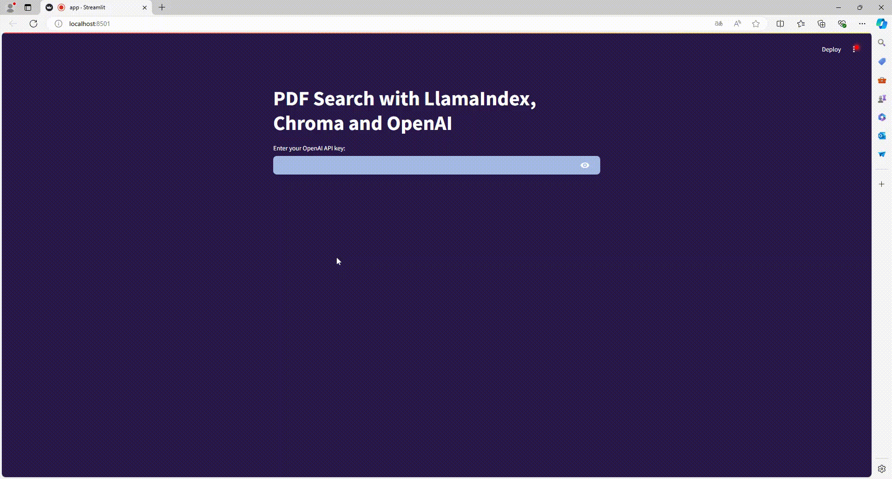

# Retrieval Augmented Generation Engine using LlamaIndex, Chroma, OpenAI and Streamlit

 

## Overview

The Retrieval Augmented Engine (RAG) is a powerful tool for document retrieval, summarization, and interactive question-answering. This project uses LlamaIndex, and Streamlit to provide a PDF Search application. With RAG, you can easily upload multiple PDF documents, generate vector embeddings for text within these documents, and perform conversational interactions with the documents. 

## Features

- **Streamlit Web App**: The project is built using Streamlit, providing an intuitive and interactive web interface for users.
- **Input Fields**: Users can input essential credentials like OpenAI API key through dedicated input fields.
- **Document Uploader**: Users can upload multiple PDF files, which are then processed for further analysis.
- **Document Splitting**: The uploaded PDFs are split into smaller text chunks, ensuring compatibility with models with token limits.
- **Vector Embeddings**: The text chunks are converted into vector embeddings, making it easier to perform retrieval and question-answering tasks.
- **Chroma Vector Store**: Here, we create a vector store using Chroma.
- **QA Interface**: Users can engage in interactive conversations with the documents, asking questions and receiving answers. 


## Prerequisites

Before running the project, make sure you have the following prerequisites:

- Python 3.7+
- LlamaIndex
- Streamlit
- An OpenAI API key
- Chroma
- PyPDF
- PDF documents to upload

## Usage

1. Clone the repository to your local machine:

   ```bash
   git clone https://github.com/theo986/PDF-Search-with-LlamaIndex-and-Chroma.git
   cd PDF-Search-with-LlamaIndex-and-Chroma
   ```

2. Install the required dependencies by running:
   ```bash
   pip install -r requirements.txt
   ```

3. Run the Streamlit app:
   ```bash
   streamlit run src/app.py 
   or
   streamlit run app.py
   ```

4. Access the app by opening a web browser and navigating to the provided URL.

5. Input your OpenAI API key and press Enter.

6. Click on the "Browse files" button to upload the PDF documents you want to analyze.

7. Wait a few seconds for the text extraction and the embeddings.

8. Engage in Q/A format with the documents by typing your questions in the input box and pressing Enter.

## Contributors

[Théo V.](https://github.com/theo986)

## Contact

If you have any questions, suggestions, or would like to discuss this project further, feel free to get in touch with me:

- [Email](mailto:tvolcouve@gmail.com)
- [LinkedIn](https://www.linkedin.com/in/théo-volcouve/)

I'm open to collaboration and would be happy to connect!
