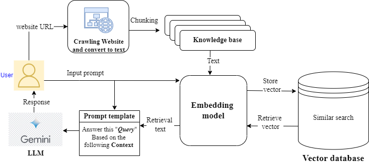

# Chat-any (chat with any website)

## 1. Introduction

In today's information-driven world, accessing relevant and accurate data quickly is paramount. Traditional search methods can be time-consuming and often yield irrelevant results, creating a demand for more efficient information retrieval systems. My web application addresses this need by allowing users to input website URLs, which are then crawled to build a comprehensive knowledge base. This knowledge base is leveraged by a Retrieval-Augmented Generation (RAG) system, enabling users to interact with the website content through intuitive, conversational AI.

## 2. Overview

- System architecture
    
    
    

The process begins by user inputing website URL. After that, a website is crawled and convert its content into text. This text is then split and embedded using the embeddings model. When a user inputs a prompt, the system performs a similarity search in the embedding space to find relevant information, which is then augmented to the original prompt. This augmented prompt is sent to the large language model (LLM), which generates a detailed and contextually appropriate response that is returned to the user. This system leverages advanced retrieval and generation techniques to provide accurate and relevant answers based on the content of the crawled website.

## 3. Installation

- Install dependencies
    
    ```python
    pip install -r requirements.txt 
    ```
    
- Because, we use Gemini-pro as LLM, so you may need to get Gemini API Key. [Get an API key](https://makersuite.google.com/app/apikey). Once you have Google API key, add it into .env file

<details><summary><b>Optional</b></summary>
    <ul>
    <li>Caching embedding model</li>
        <ul>
            <li>Make <code>weights/</code> and move into the directory:
            <pre><code>!git lfs install
!git clone https://huggingface.co/BAAI/bge-small-en</code></pre>
            </li>
        </ul>
    <li><code>cd ..</code> to move back to the previous directory</li>
    <li>Now, uncomment <code># os.environ["HF_HOME"] = "/workspaces/chat-any/weights"</code> line in <code>app.py</code></li>
    </ul>
</details>


## 4. Usage

- To run demo app with Streamlit
    
    ```python
    streamlit run app.py
    ```

# Demo

[](https://www.youtube.com/watch?v=8gFe_jw_onQ)

## Limit

- Can only handle **english** language (Because I use [Huggingface: BAAI/bge-small-en](https://huggingface.co/BAAI/bge-small-en) as embedding model)
- I don’t focus on optimizing inference, so creating embeddings or other processes may take a while 🐢. Please take a deep breath and be patient, my friend! 🙏